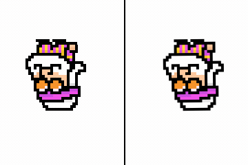

# Subpixel sampling
Test texture sampling for smooth pixel art in love2d. When doing
nearest-neighbor sampling on pixel art (which is the default for most pixel-art
games unfortunately), the sprites will experience jitter and artifacting during
scaling/rotation/movement. This repo aims to demonstrate the solution in simple
terms.

## Comparison
**Left** - default. **Right** - subpixel sampling.




## Running

Clone the repo and run `love .` from inside.


You can try out multiple different shaders and movement types and compare them
side-by-side with each other.
    
- Use keypad numbers 4/5/6 to cycle between movement/rotation/scaling methods.
- Hover over your desired side with your mouse and use the keypad numbers 1/2/3
  to cycle between the filter/shader/padding.
- Read the shader code where all the magic happens (`subpixel.frag` and others)


## Usage
To add this fix to your pixel art games, do the following:
- Copy `subpixel_d7samurai.frag` or `subpixel_grad.frag` to your game's
  directory.
- When drawing anything, you use the shader and send the texture size to it:
```lua
subpixel_shader = love.graphics.newShader("subpixel_grad.frag")
player_sprite = love.graphics.newImage("player.png")
player_sprite:setFilter("linear", "linear") -- Important!
player_texture_size = {
   player_sprite:getWidth(),
   player_sprite:getHeight()
}

function love.draw()
   -- Draw the player sprite with the subpixel shader
   love.graphics.setShader(subpixel_shader)
   subpixel_shader:send("texture_size", player_texture_size)
   love.graphics.draw(player_sprite, x, y, r, sx, sy)
   love.graphics.setShader()
end
```
- Even when using love2d's quads (with a spritesheet), you must send the entire
  texture's size to the subpixel shader.
